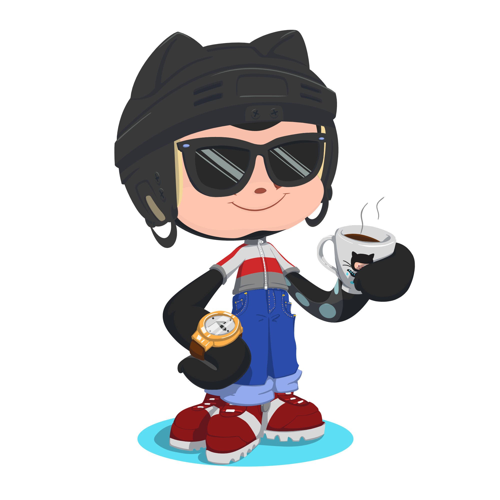

    

## <h1 align="center">Hi there I am Nurpolat ( NP ) </h1>

### <h3 align="center"> The Self-Taught Programmer </h3>
##### <h5 align="center"> Backend strong mega super happy max pluss + S+  Junior developer </h5>

---

###   More About Me:

-  I’m currently working on ... Django
-   I’m currently learning ... Software & Backend Engineering 
-  I’m looking to collaborate on ... Best Developers :)
-  I’m looking for help with ... learn js front framework
-  Ask me about ... Anything
-  How to reach me: ... [Telegram => NP_Nurpolat](https://t.me/NP_Nurpolat)
-  Pronouns: ... Motivated
-  fact: ... ‌If knowledge is power knowing what we don't know is wisdom

---

[comment]: <> (
)

[comment]: <> ()

### 🔨 Backend :

  
### 🖼 Frontend :

### ⚙️ Tools :

### ⚡ Database :

<!--  -->

### Reach me on : 

###   My GitHub Stats

